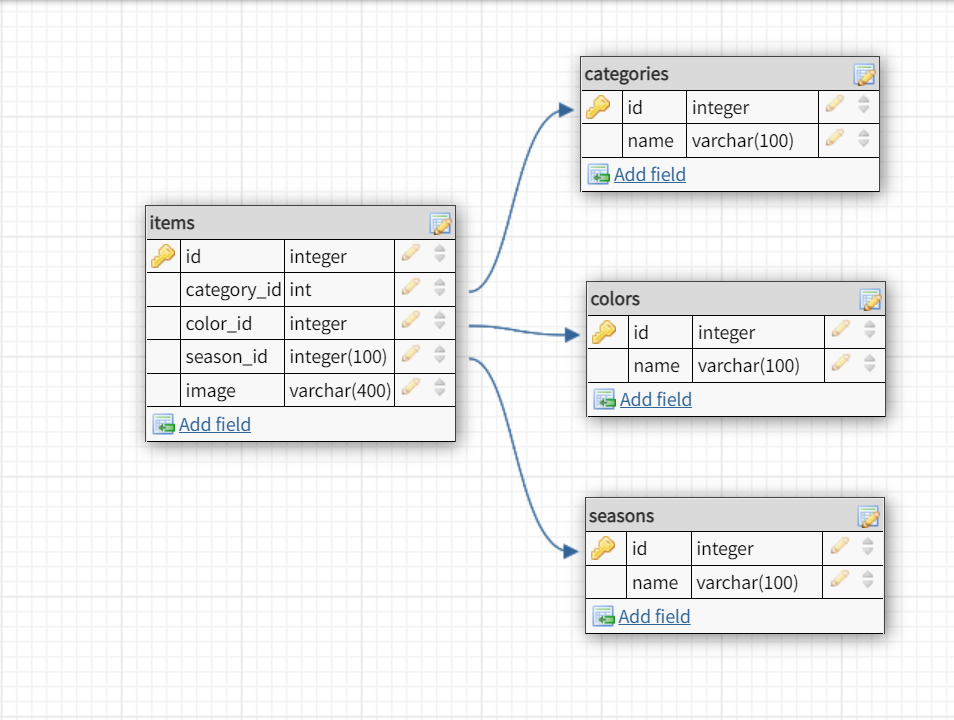

# GELook App

В этом репозитории хранится приложение GELook, созданное на стэке HTML/CSS, React, Node/Express, MySQL.

## Установка

### Зависимости

Запустите команду `npm install` в директории распакованного проекта.

Затем `cd client` и запустите `npm install` для установки всех зависимостей React.

### База данных

Создайте файл с пустым названием и расширением `.env` в папке проекта, со следующим содержагием:

```
DB_HOST=localhost
DB_USER=YOUR_USERNAME
DB_NAME=my_wardrobe
DB_PASS=YOUR_PASSWORD

```

(замените `YOUR_USERNAME` и `YOUR_PASSWORD` с данными вашего пользователя MySQL)

В командной строке MySQL Command Line Client выполните команду для создания БД: `create database my_wardrobe;`.

- Выполните команду `npm run migrate` в папке проекта, используя новое окно терминала. Это создаст 4 таблицы: `categories`, `items`, `colors`, `seasons`.
- `categories` содержит 14 строк
- `colors` содержит 12 строк
- `seasons` содержит 4 строки


### Development

- Выполните команду `npm start` в папке прокта для запуска сервера Express на порту 5000
- В другом окне терминала выполните `cd client` и запустите `npm start` для запуска клиентского окна на порту 3000.

## ER диаграмма


